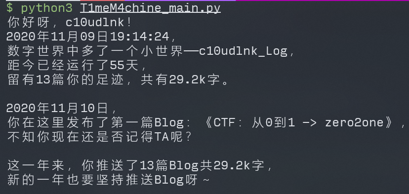
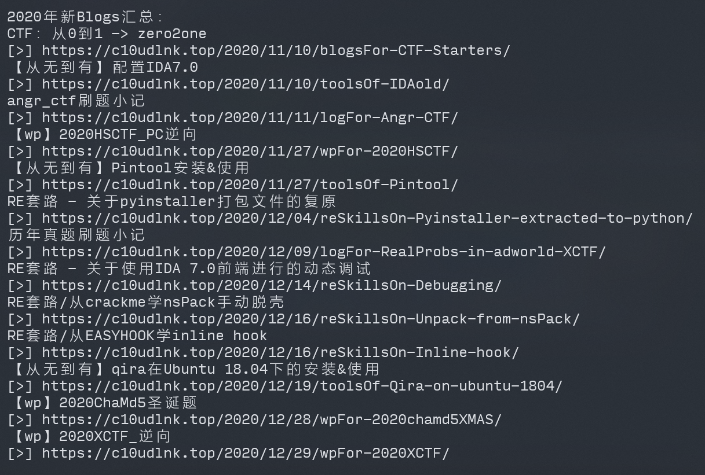

# hexo-T1meM4chine

为你的hexo博客生成年度数据报告！

## Introduction

每逢年末，各大app就开始推送年度总结，但是自己搭建的个人hexo博客却没有，怪难受的hhh。

于是决定自己手撸一个，~~满足一下个人需求（划~~

这是一个使用python制作的小脚本，旨在**为个人hexo博客生成上一年的年度数据报告**（划重点，一定要过了这一年才可以哦）。

目前只用了自己的博客来测试，不知道兼容性如何，如有bug欢迎提issue！0v0

## Usage

### 环境

python（最好3.6+）

### 必备的python依赖库

- Beautiful Soup

  用于解析html和xml源码，指路官网：[Beautiful Soup 4.2.0 文档 — Beautiful Soup 4.2.0 documentation](https://www.crummy.com/software/BeautifulSoup/bs4/doc/index.zh.html#id5)

  或者直接输入

  ```shell
  pip install beautifulsoup4
  pip install lxml
  ```

- requests

  用于获取html源码。

  ```shell
  pip install requests
  ```

### Hexo插件依赖

- hexo-generator-feed：[hexojs/hexo-generator-feed: Feed generator for Hexo.](https://github.com/hexojs/hexo-generator-feed)

  本脚本通过抓取atom.xml数据实行后续数据统计，**必备**。

- hexo-wordcount：[willin/hexo-wordcount: A Word Count Plugin for Hexo](https://github.com/willin/hexo-wordcount)

  统计字数部分将直接使用wordcount插件的数据。

### 使用

将`T1meM4chine_main.py`中的my_name改成自己的用户名以后，运行即可。

```python
from T1meM4chine_api import *
import time

if __name__=='__main__':
    # -=-=-=将my_name修改为你的用户名-=-=-=
    my_name="c10udlnk"
    # -=-=-=-=-=-=-=-=-=-=-=-=-=-=-=-=-=
    my_hexo_repo="https://github.com/"+my_name+"/"+my_name+".github.io"
    my_hexo_branch="/master"
    atom_link=my_hexo_repo+"/raw"+my_hexo_branch+"/atom.xml"
    api_header="https://api.github.com/repos/"+my_name+"/"+my_name+".github.io"
    homepage_info,all_page_info=parseAtomXML(atom_link)
    year=str(int(time.asctime(time.localtime())[-4:])-1)
    homepage_info.update(parseHeader(api_header))
    makeAnnualReview(homepage_info,all_page_info,year)
```

## Show





## Q&A

- 报错`requests.exceptions.ConnectionError: ......[Errno 111] Connection refused'`：

  是无法连接raw.githubusercontent.com引起的，建议按照[Failed to connect to raw.githubusercontent.com port 443: Connection refused - 远近啊 - 博客园](https://www.cnblogs.com/Dylansuns/p/12309847.html)中的方法处理。

- `requests.exceptions.ConnectionError: ('Connection aborted.', ConnectionResetError(104, 'Connection reset by peer'))`：

  请求频繁，稍后再运行脚本即可。

- 如有其他问题，欢迎提issue！

## TODO

- 增加阅读量总结，拟使用[不蒜子](http://ibruce.info/2015/04/04/busuanzi/)数据，因为要用到[Selenium](https://zhuanlan.zhihu.com/p/111859925)才能获取到阅读量的数值，故暂时没做。
- 字数统计不够精确，后续将通过改造wordcount插件来记录字数精确值（而不是四舍五入到k）。
- 将通过爬取commits数据进行推送连续天数的统计和深夜爆肝统计，还要过滤hexo一些渲染设置的改动，可能是一项大工程。
- 日后将添加生成Markdown、LaTeX、H5样式的年度报告的功能，不仅仅只有文字！
- 处理大量数据时速度较慢，毕竟爬github，后续看看怎么加速一下。

## Update log

### v1.0

从0到1撸了个大概能用的原型，功能就是这样没什么好说的啦~

