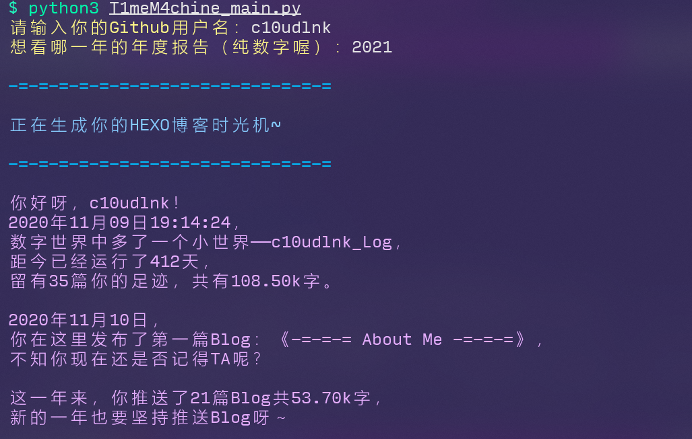
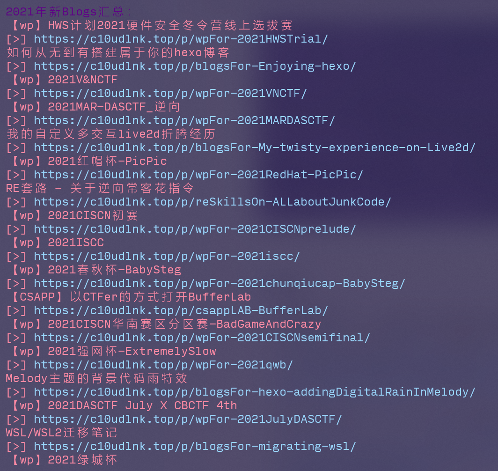
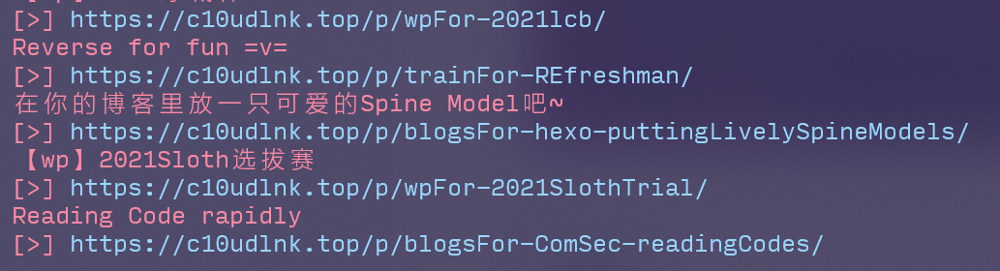
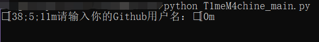

# hexo-T1meM4chine

为你的hexo博客生成年度数据报告！

## Introduction

每逢年末，各大app就开始推送年度总结，但是自己搭建的个人hexo博客却没有，怪难受的hhh。

于是决定自己手撸一个，~~满足一下个人需求（划~~

这是一个使用python制作的小脚本，旨在**为个人hexo博客生成某一年的年度数据报告**。

目前只用了自己的博客来测试，不知道兼容性如何，如有bug欢迎提issue！0v0

鲁棒性不强，还请各位轻点打 >x<

## Usage

### 环境

python（最好3.6+）

### 必备的python依赖库

- Beautiful Soup

  用于解析html和xml源码，指路官网：[Beautiful Soup 4.2.0 文档 — Beautiful Soup 4.2.0 documentation](https://www.crummy.com/software/BeautifulSoup/bs4/doc/index.zh.html#id5)

  或者直接输入

  ```shell
  pip install beautifulsoup4
  pip install lxml
  ```

- requests

  用于获取html源码。

  ```shell
  pip install requests
  ```

### Hexo插件依赖

- hexo-generator-feed：[hexojs/hexo-generator-feed: Feed generator for Hexo.](https://github.com/hexojs/hexo-generator-feed)

  本脚本通过抓取atom.xml数据实行后续数据统计，**必备**。

- hexo-wordcount：[willin/hexo-wordcount: A Word Count Plugin for Hexo](https://github.com/willin/hexo-wordcount)

  统计字数部分将直接使用wordcount插件的数据。

### 使用

运行`T1meM4chine_main.py`，填入github用户名和想查看的年份即可。

## Show







## Q&A

- 发现篇数过少：

  请检查**hexo-generator-feed**插件设置中的`limit`，默认只收录20篇，需要调整请在`_config.yml`中设置`limit: 0`来禁用收录限制。

- 颜色出现乱码：

  

  经过测试，目前Linux环境下是完全没问题的~~（别用破windows啦）~~；Windows环境下wsl是没问题的，在windows terminal中打开cmd或者powershell来跑脚本也是没问题的。

  出现问题的情况是在**直接启动cmd或者powershell（而不是经由windows terminal打开）**的时候。

  解决方法：**用Linux！**用wsl！实在不行搞个windows terminal吧（逃

- 报错`requests.exceptions.ConnectionError: HTTPSConnectionPool(host='raw.githubusercontent.com', port=443): Max retries exceeded with url: ......(Caused by NewConnectionError('......: Failed to establish a new connection: [Errno 111] Connection refused',))`：

  是（偶尔）无法连接raw.githubusercontent.com引起的，建议按照[Failed to connect to raw.githubusercontent.com port 443: Connection refused - 远近啊 - 博客园](https://www.cnblogs.com/Dylansuns/p/12309847.html)中的方法处理。

- 报错`requests.exceptions.ConnectionError: ('Connection aborted.', ConnectionResetError(104, 'Connection reset by peer'))`：

  请求频繁，稍后再运行脚本即可。

- 如有其他问题，欢迎提issue！

## TODO

- 拓展使用范围，本代码仅针对Melody主题（需要用到本主题特定的class等），经测试Butterfly主题同样适配。
- 添加对cmd的上色支持。
- 增加阅读量总结，拟使用[不蒜子](http://ibruce.info/2015/04/04/busuanzi/)数据，因为要用到[Selenium](https://zhuanlan.zhihu.com/p/111859925)才能获取到阅读量的数值，故暂时没做。
- 字数统计不够精确，后续将通过改造wordcount插件来记录字数精确值（而不是四舍五入到k）。
- 将通过爬取commits数据进行推送连续天数的统计和深夜爆肝统计，还要过滤hexo一些渲染设置的改动，可能是一项大工程。
- 日后将添加生成Markdown、LaTeX、H5样式的年度报告的功能，不仅仅只有文字！
- 处理大量数据时速度较慢，毕竟爬github，后续看看怎么加速一下。

## Update log

### v2.02

- Blog_title改为从"site-title"里抓取，而不是网页标题。~~（考虑到有些人的网页标题并不是站名）~~

### v2.01

- 修改了某些主题没有subtitle导致对应错误的bug。

### v2.0

- 大规模重构代码，对一些不合代码规范的部分进行了修改。

- 给文字报告刷上颜色啦~

- 现在可以对年度总结的年份进行指定了，同时适配年末总结选手 && 年初总结选手。

- TODO一项没做，别期待了（逃

  ~~（真就年更项目呗）~~

### v1.0

- 从0到1撸了个大概能用的原型，功能就是这样没什么好说的啦~

